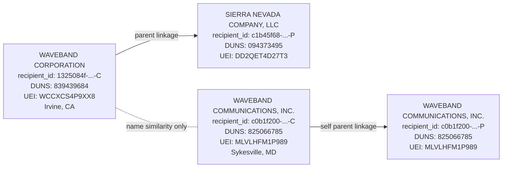

# WaveBand Identity Evidence Graph

Purpose: rapid claim-checking map for entity identity and lineage during T3/T4 attribution analysis.

Use this before asserting any linkage between MEDUSA-era records and modern procurement records.

## 1) Entity graph (Mermaid)

Interpretation: `A` and `C` are distinct recipient identity graphs in USAspending.

## 2) Evidence table (node -> source file)

| Node / edge | Evidence file |
|---|---|
| `WAVEBAND CORPORATION` node (ID/DUNS/UEI/location) | `investigation-dig/usaspending-recipient-waveband_corp.json` |
| `SIERRA NEVADA COMPANY, LLC` parent node | `investigation-dig/usaspending-recipient-snc_parent.json` |
| `A -> B` parent linkage | `investigation-dig/usaspending-recipient-waveband_corp.json` |
| `WAVEBAND COMMUNICATIONS, INC.` node | `investigation-dig/usaspending-recipient-waveband_comms.json` |
| `C -> D` self-parent pattern | `investigation-dig/usaspending-recipient-waveband_comms.json` |
| SNC parent-child graph containing WaveBand Corporation | `investigation-dig/usaspending-children-DD2QET4D27T3.json` |
| Communications child graph (self-contained) | `investigation-dig/usaspending-children-825066785.json`, `investigation-dig/usaspending-children-MLVLHFM1P989.json` |

## 3) Fast claim-check rules

- If a claim references MEDUSA-era WaveBand, it must resolve to:
  - `recipient_id 1325084f-...-C` or
  - archived MEDUSA artifacts (`medusa-navysbir-wayback.html`) with consistent contractor identity.
- If a claim references modern communications contracts, it must resolve to:
  - `recipient_id c0b1f200-...-C` / `...-P`.
- Do not bridge these lines unless new hard-link artifact provides explicit legal successor mapping.

## 4) Allowed / disallowed phrasing

Allowed:
- "Name-similar but API-distinct entities."
- "MEDUSA-era WaveBand maps to SNC-linked graph; communications line is separate."

Disallowed (unless new merger proof appears):
- "Waveband Communications is the same entity as MEDUSA WaveBand."
- "Modern comms contracts evidence MEDUSA operational continuity."
